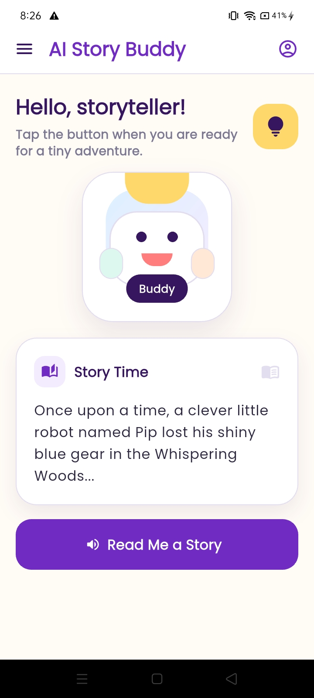
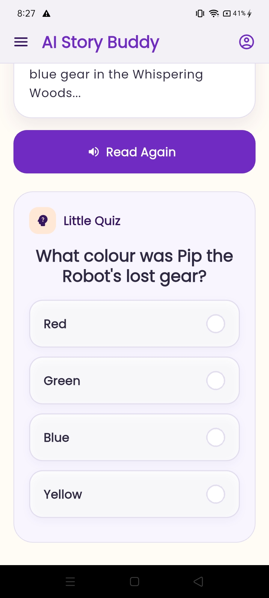
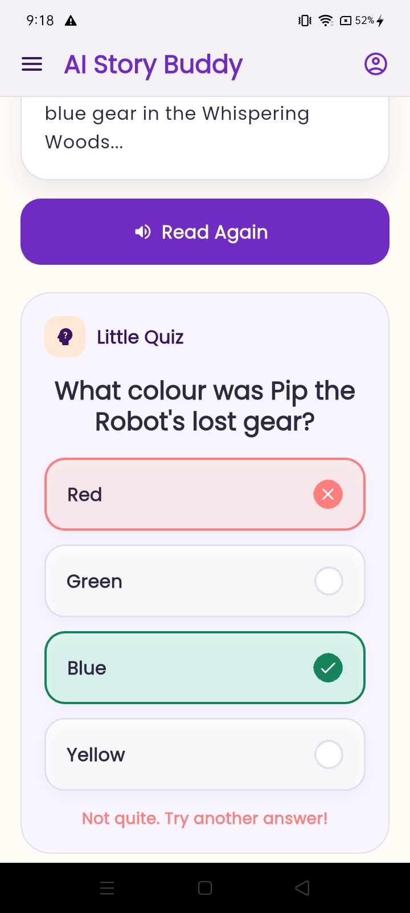
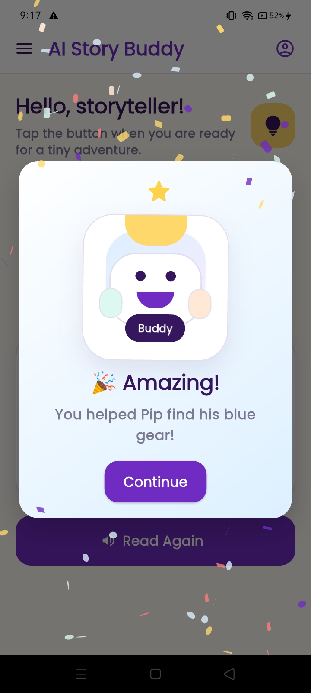

# Peblo AI Story Buddy

## Project Overview

Peblo AI Story Buddy is a single-screen Flutter app built for the Peblo Flutter Developer Internship Assessment. The app delivers a child-friendly storytelling experience that reads a short narrative with Text-to-Speech and then reveals a quiz automatically when narration completes.

This submission demonstrates clean app architecture, Riverpod state management, audio lifecycle handling, and performance-aware design for mid-range Android devices (~3GB RAM).

## Features

- Story narration using `flutter_tts`
- Audio playback state management with Riverpod
- Automatic quiz reveal after narration finishes
- Quiz rendering driven by JSON-ready quiz models
- Wrong answer visual feedback with retry guidance
- Correct answer celebration using confetti and happy buddy state
- Child-friendly UI optimized for mid-range Android performance

## Screenshots









## App Flow

Launch App
↓
Read Me A Story
↓
Audio Loading
↓
Audio Playing
↓
Narration Completes
↓
Quiz Appears
↓
Wrong Answer → Shake Feedback
↓
Correct Answer → Celebration & Success State

## Architecture Overview

The app separates presentation, service integration, and business logic into distinct layers so each concern remains easy to follow and maintain.

- `lib/main.dart`: application entry point with `ProviderScope`
- `lib/screens/story_buddy_screen.dart`: single interactive screen, audio orchestration, and quiz flow
- `lib/providers/audio_provider.dart`: audio state and error management
- `lib/providers/quiz_provider.dart`: quiz visibility, answer submission, and status transitions
- `lib/services/tts_service.dart`: wrapper around `flutter_tts` for initialization, speech control, and lifecycle handling
- `lib/models/quiz_model.dart`: quiz schema and JSON serialization helpers
- `lib/widgets/`: reusable UI components for story card, quiz card, buddy, success overlay, and answer buttons

## Architecture Diagram

```text
UI Layer
↓
Riverpod Providers
↓
Audio Provider / Quiz Provider
↓
TTS Service
↓
Flutter TTS Engine

Quiz JSON
↓
QuizModel
↓
Dynamic Quiz Renderer
```

## Why Flutter

Flutter was chosen because it provides:

- a single codebase for Android, iOS, web, and desktop
- fast, consistent rendering across platforms
- declarative UI for polished child-friendly interfaces
- built-in support for responsive design and animation

This project uses Flutter’s compositional widget model to create a visually engaging experience without platform-specific complexity.

## Why Riverpod

Riverpod was selected because it offers:

- predictable and immutable state handling
- fine-grained reactivity with selective rebuilds
- clean dependency injection for services
- lifecycle cleanup with `ref.onDispose`

Riverpod keeps audio state, quiz state, and service lifecycle separate from UI code, improving readability and maintainability.

## Data-Driven Quiz Implementation

The quiz model is designed to be JSON-friendly and reusable:

- `question`: prompt displayed in the UI
- `options`: immutable list of answer choices
- `answer`: correct response string

`QuizModel` supports `fromJson` and `toJson`, enabling later migration to external asset or remote quiz data. The current screen uses a model-driven quiz instance, and the UI renders options dynamically through `QuizCard`.

## Audio Lifecycle & State Management

Audio lifecycle handling is centralized in a dedicated provider and service layer:

- `AudioNotifier` tracks states: `idle`, `loading`, `playing`, `completed`, `error`
- `TtsService` initializes `flutter_tts` and configures language, speech rate, pitch, and volume
- completion callbacks transition audio state to `completed` and trigger the quiz reveal
- error callbacks update state with contextual messages and prevent UI crashes
- `ref.onDispose` ensures TTS resources are released when the provider goes away

This approach keeps playback control deterministic and prevents conflicting audio interactions.

## Error Handling Strategy

The app implements error handling at multiple levels:

- `TtsService` throws `TtsServiceException` with specific failure context
- calling code catches service-specific and generic exceptions separately
- audio errors are surfaced in the UI through `AudioState.errorMessage`
- state transitions avoid invalid quiz actions when the quiz is hidden

This layered strategy keeps the experience stable and user-facing failures clear.

## Performance Profiling

Performance profiling was validated with Flutter DevTools and the Performance Overlay. Key profiling and optimization decisions include:

- using Flutter DevTools to inspect frame rendering and rebuild behavior
- enabling the Performance Overlay for real-time frame analysis
- applying `const` constructors where possible for compile-time widget reuse
- separating widgets into focused, small components
- using `Provider.select` to reduce Riverpod rebuild scope
- relying on lightweight local TTS integration rather than heavier audio players
- tuning animations for smooth execution on mid-range Android hardware

## Optimizations for Low-End Android Devices

The app is optimized for constrained devices through:

- responsive layout with maximum width constraints and adaptive padding
- minimal use of heavy visual effects and controlled animation complexity
- disabling buttons during async TTS operations to reduce input jitter
- consistent disposal of a single TTS instance to conserve memory
- keeping story and quiz data local to avoid network dependency

These choices reduce jank, memory pressure, and power consumption on entry-level hardware.

## Packages Used

- `flutter_riverpod` — state management and dependency injection
- `flutter_tts` — native text-to-speech playback
- `flutter_confetti` — success celebration animation
- `flutter_animate` — compact animation helpers
- `google_fonts` — consistent custom typography across platforms
- `cupertino_icons` — platform-aware iconography

## AI Usage & Development Process

AI tools were used as development assistants for:

- architecture planning
- code review feedback
- implementation guidance
- animation and UI ideas
- README drafting

One AI suggestion that was rejected was introducing multiple layered success animations. That approach increased rendering complexity for the target mid-range Android devices, so a lighter celebration experience was chosen instead.

One challenge during development was coordinating the TTS completion event with quiz visibility. The solution was to route completion through Riverpod state updates, which made the transition reliable and decoupled from direct widget control.

All generated suggestions were reviewed, tested, and adapted manually.

## Future Improvements

Planned improvements for the next iteration include:

- dynamic story selection and multiple story paths
- audio controls for pause, resume, and voice selection
- persistent progress tracking and user profile state
- loading quiz content from JSON assets or remote configuration
- accessibility improvements for screen readers and larger text
- offline caching and low-bandwidth support

## Run Instructions

To run the app locally:

1. Install Flutter and configure your platform toolchain.
2. Open the repository in your Flutter-capable editor.
3. Run `flutter pub get`.
4. Run `flutter run`.

For a specific device, use:

```bash
flutter run -d <device-id>
```

For release builds:

```bash
flutter build apk
flutter build ios
```

---

This README is written to reflect the current codebase and support an internship-quality submission with a clear architecture, state management rationale, and implementation-focused notes.
